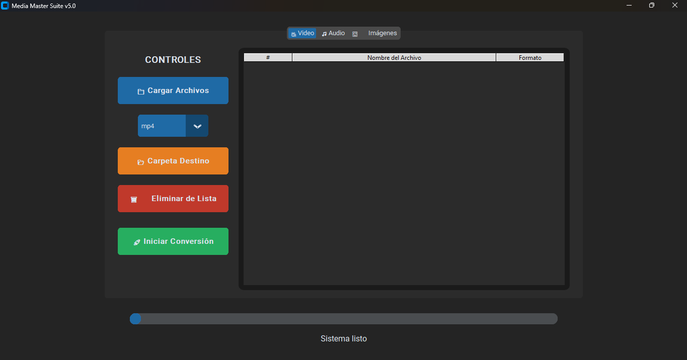

# 🚀 Media Master Suite v1.0


**Media Master Suite** es una herramienta de escritorio potente y minimalista diseñada para la conversión por lotes de video, audio e imágenes. Con una interfaz moderna basada en `CustomTkinter`, permite gestionar múltiples archivos de forma eficiente y profesional.

---

## ✨ Características Principales

* **⚡ Conversión Multimedios:** Soporta los formatos más populares (MP4, MKV, MP3, WAV, WEBP, PNG, JPG, etc.).
* **📊 Gestión por Tablas:** Visualiza tus archivos en una tabla detallada con columnas para nombre y extensión actual.
* **🛡️ Detección Inteligente:** El sistema detecta automáticamente si un archivo ya tiene el formato de destino y lo omite para ahorrar tiempo y recursos.
* **📂 Flujo de Trabajo Contextual:** Pestañas separadas para Video, Audio e Imágenes con filtros de selección específicos.
* **🛠️ Control Total:** Permite eliminar archivos específicos de la lista antes de iniciar el proceso.
* **🚀 Acceso Directo:** Al finalizar, la app permite abrir la carpeta de destino con un solo clic.

---

## 📸 Capturas de Pantalla

> `![Preview]
---

## 🛠️ Requisitos e Instalación

### Opción 1: Usuario Final (Ejecutable)
1. Descarga el archivo `.zip` desde la sección de [Releases](../../releases).
2. Descomprime la carpeta.
3. Ejecuta `MediaMasterSuite.exe`.
   * **Nota:** Asegúrate de tener `ffmpeg.exe` en la misma carpeta o instalado en tu sistema PATH.

### Opción 2: Desarrolladores (Código Fuente)
Si deseas ejecutar el script manualmente, necesitas:
1. **Python 3.10+**
2. **FFmpeg** instalado y configurado en las variables de entorno.
3. Instalar las dependencias:
   ```bash
   pip install customtkinter Pillow